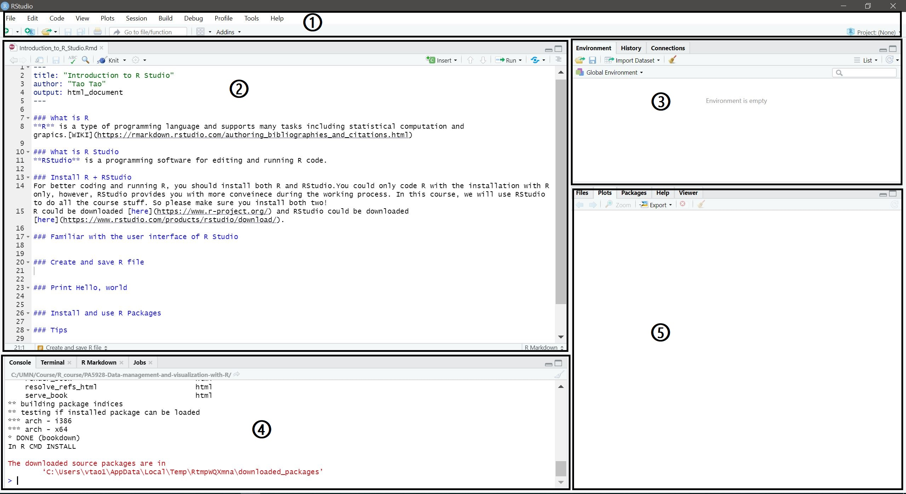
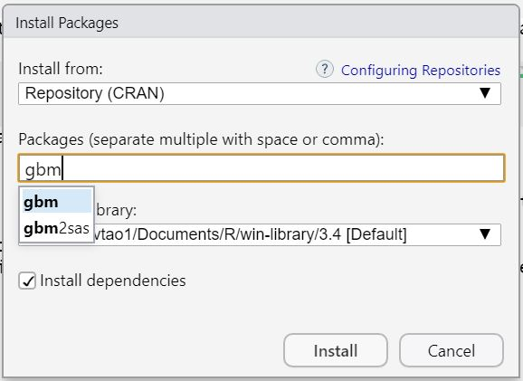

# Introduction to RStudio

In this chapter, we will cover some basic operations in RStudio.

## What is R
**R** is a type of programming language and supports many tasks including statistical computation (data cleaning, data management, [statistics](https://r-statistics.co/Linear-Regression.html), [machine learning](https://vtao1989.github.io/DisToTransit_statistics/)) and graphics ([static plots](http://r-statistics.co/Top50-Ggplot2-Visualizations-MasterList-R-Code.html) and [interactive plots](https://plot.ly/r/3d-surface-plots/)). You can also use it to create website (like this course website), write papers, analyze texts, *etc*. The most important thing is that **R is free and easy to use**, that's why it has been applied in many fields.

## What is RStudio
**RStudio** is a programming software for editing and running R code. It has many great features to make R programming easier!

## Install R + RStudio
For better coding and running R, you should install both R and RStudio. You could code R with the installation of R only, however, RStudio provides you with more convenience in coding. In this course, we will use RStudio to do all the course lectures and exercises. Please make sure you install both of them!  
R could be downloaded [here](https://www.r-project.org/) and RStudio could be downloaded [here](https://www.rstudio.com/products/rstudio/download/) (choose the free version). Both Windows OS (Operating System) and Mac OS are supported. You should choose the right one you need for your own system. (If you have any questions about the installation of R or RStudio, please come during the office hours or ask [IT](https://it.umn.edu/) for help).

## Familiar with the user interface of RStudio
Below is a screenshot of the user interface of RStudio. You will find couple of panes/windows with different usages.[@Selvam2019]

1. **Menu/Tool Bar**
2. **Source**  The pane where you write and edit your codes.
3. **Environment/History** Environment lists all the variables that you are currently using. History presents the codes you have run before.
4. **Console** Console is the original R interactive window. You could run codes and see the results here.
5. **Plot/Help** Plot window shows the output figures. Help window presents the information of the function or package you are checking.



## Create and save R file
Three ways to create an R file in the RStudio:
```
1. Menu -> File -> New File -> R Script
2. Shortcut: Ctrl + Shift + N
3. Tool Bar -> New file button
```

Also three ways to save R file
```
1. Menu -> File -> Save
2. Shortcut: Ctrl + S
3. Tool Bar -> Save file button
```

## Print Hello, world
It's time to code something and output the results! Let's print the very classic "Hello, world!" with ``print()`` function.  
After coding, we could run our codes in several ways:

1. Select the codes or put the cursor in the line of your code, and click the Run button located in the right-top position of the ``source`` pane.
2. Select the codes or put the cursor in the line of your code, and use shortcut: Ctrl + Enter
3. You could also click the Re-run button near the Run button to re-run the codes you ran last time.

```{r}
print('Hello, world!')
```

Because what we need to output here is a **string variable**, we have to put them in the quotation mark. Either single quotation or double quotation mark works well. Let's see another example.

```{r}
print(5928)
```

Here, 5928 is an integer and we do not need to put them in the quotation marks.

## Install and use R Packages
R is easy to use because it has tons of packages with different usages. These packages could help you accomplish some complex tasks with just several lines of codes (another reason we like to use R).  
Some packages have already been installed and you could use them directly, which are ``base packages``.   However, most of the packages have to be installed before being called in the codes. There are couple of ways you could install a package. Let's take the ``tidyverse`` package for example.
```
1. Manu -> Tools -> Install Packages... -> Input the package name -> Click Install button
```
<center>
{ width=35% }
</center>

```
2. Use the code below:
install.packages("gbm")
```

After the installation of the package, you have import it with ``library()`` function before you use the functions in the package.
```{r}
library(gbm)
```

We will spend more time in future classes to explore the various R packages and their usages.

## Make notes
It is important to write notes for your codes. It could help others or even yourself understand your codes easily. Use hash tag to indicate the notes. For example,
```{r, eval=FALSE}
gbm1 <- gbm(AvgMet~PkAreaH+StpNumH+DisToMin,  # formula
            data=MetM,                        # dataset  
            var.monotone=c(+1, rep(0,10),rep(0,15)), 
            distribution="gaussian",          # see the help for other choices  
            n.trees=5000,                     # number of trees  
            shrinkage=0.001,                  # shrinkage or learning rate, 0.001 to 0.1 usually work  
            interaction.depth=6,              # 1: additive model, 2: two-way interactions, etc.  
            bag.fraction = 0.5,               # subsampling fraction, 0.5 is probably best  
            n.minobsinnode = 10,              # minimum total weight needed in each node
            cv.folds = 5)
```
R will not run the codes after hash tags in each line.

Please try to write simple but necessary notes for the codes. Keep this as a good habit and you will thank yourself in the future.

## Tips
1. You could divide your codes into sections by putting chunks before each sections with the shortcut ``Ctrl + Shift + R``. This will help you organize your codes. You could run the codes in the chunk by the shortcut ``Ctrl + Alt + T``.
2. Use ``?`` or ``help()`` function to find the related instruction or help page, for example, if you want to find the instruction of ``library()`` function, just code
```
?library
```
or
```
help(library)
```
Both will direct you to the instruction page in the help window where you can find how to use these functions.

